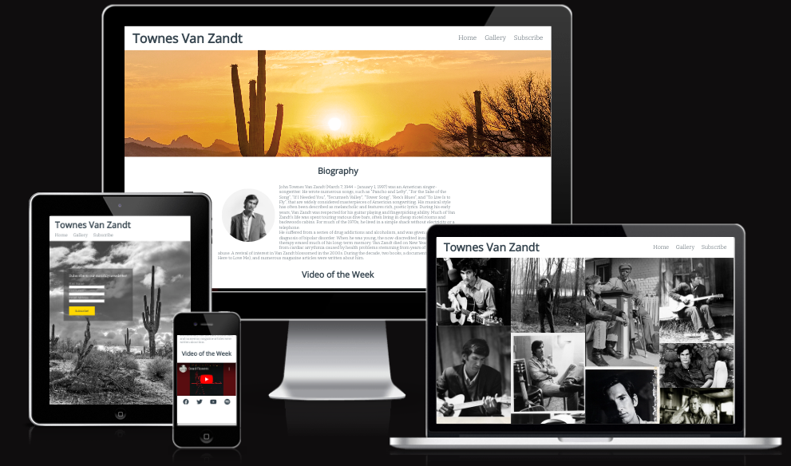

# Townes Van Zandt

The Townes Van Zandt website is for anyone looking to find out more about musician Townes Van Zandt. Users of this website will be able to read biographical information, view images, play videos and subscribe to a newsletter to keep up to date with the latest content from the website.

## Features

### Existing Features

- Navigation Bar

    - Featured on all three pages, the full responsive navigation bar includes links to the Logo, Home page, Gallery and Subscribe page and is identical in each page to allow for easy navigation.

    - This section will allow the user to easily navigate from page to page across all devices without having to revert back to the previous page via the ‘back’ button.

- Biography section

    - This section will allow the user to read biographical information and contain an image of Townes

- Video of the Week section

    - This section will allow the user to view a new video each week in order to persuade return visits.

- The Footer

    - The footer section includes links to external sites relating to Townes Van Zandt. The links will open to a new tab to allow easy navigation for the user.

- Gallery

    - The gallery will provide the user with various images of Townes.

    - The gallery is valuable to the user as it gives a sense of what type of person Townes was.

- The Subscribe Page

    - This page will allow the user to sign up to a newsletter. The user will be asked to submit their full name and email address.

Features Left to Implement

- I was planning to have a discography section beneath the biography section but had to leave it out due to time constraints and difficulty finding suitable images

## Testing

### Validator Testing

- HTML

    - No errors were returned when passing through the official W3C validator

- CSS

    - No errors were found when passing through the official (Jigsaw) validator

### Lighthouse

### Deployment

- The site was deployed to GitHub pages. The steps to deploy are as follows:
    - Under the repository name, click ⚙ Settings. If you cannot see the "Settings" tab, select the dropdown menu, then click Settings.
    - In the "Code and automation" section of the sidebar, click Pages
    - Under "Build and deployment", under "Branch", use the None or Branch dropdown menu and select a publishing source.
    - Once the master branch has been selected, the page will be automatically refreshed with a detailed ribbon display to indicate the successful deployment.

The live link can be found [here](https://gersmyth22.github.io/townes-van-zandt/index.html)

### Credits

#### Images

[Hero image](https://new.azwater.gov/news/articles/2021-12-05)

[Gallery images 1 to 9](https://townesvanzandt.com/news/)

[Gallery image 10](https://www.theguardian.com/music/2019/mar/11/townes-van-zandt-sky-blue-folk-blues-country-unreleased-album)

[Gallery image 11](https://www.kpbs.org/news/arts-culture/2009/10/12/steve-earle-does-townes-van-zandt-belly-tavern)

[Gallery image 12](https://www.houstonchronicle.com/entertainment/music/article/Something-new-from-Townes-Van-Zandt-and-Stevie-4250234.php)

[Form background image](https://pixels.com/featured/sonoran-desert-in-black-and-white-saija-lehtonen.html)

[Biography Image](https://i.scdn.co/image/8f64454676d74cd2232b9f4733ae617b957e7078)

#### Content

Biography text taken from [Wikipedia](https://en.wikipedia.org/wiki/Townes_Van_Zandt)

For the biography section I referenced https://www.youtube.com/watch?v=kMT54MPz9oE&ab_channel=freeCodeCamp.org

The form, gallery, header, nav bar and footer were all built referencing the Love Running project

For the video section I nested iframe in a p element to center video as per https://support.bigcommerce.com/s/question/0D54O00006BiAMaSAN/help-me-center-an-embedded-video?language=en_US

I made the video responsive as per https://youtu.be/9YffrCViTVk

#### Other

Created github repository referencing the Code Institute videos "Creating a Gitpod Workspace" and "Using our template"

Created assets folder, css subfolder and images subfolder as per Love Running(LR) 02

Added boilerplate html using ! emmet abbreviation

Added page description as per LR 03

Added keywords as per LR 03
